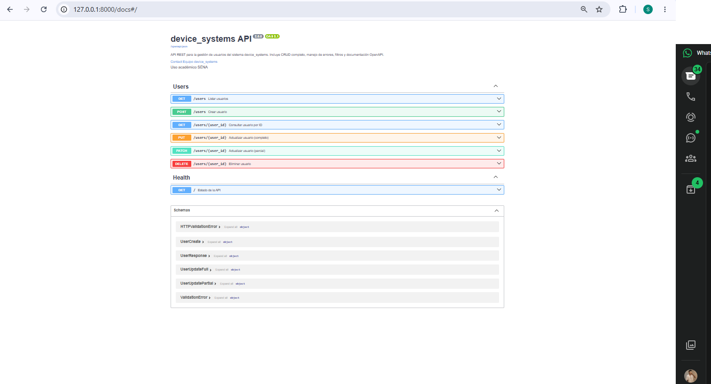
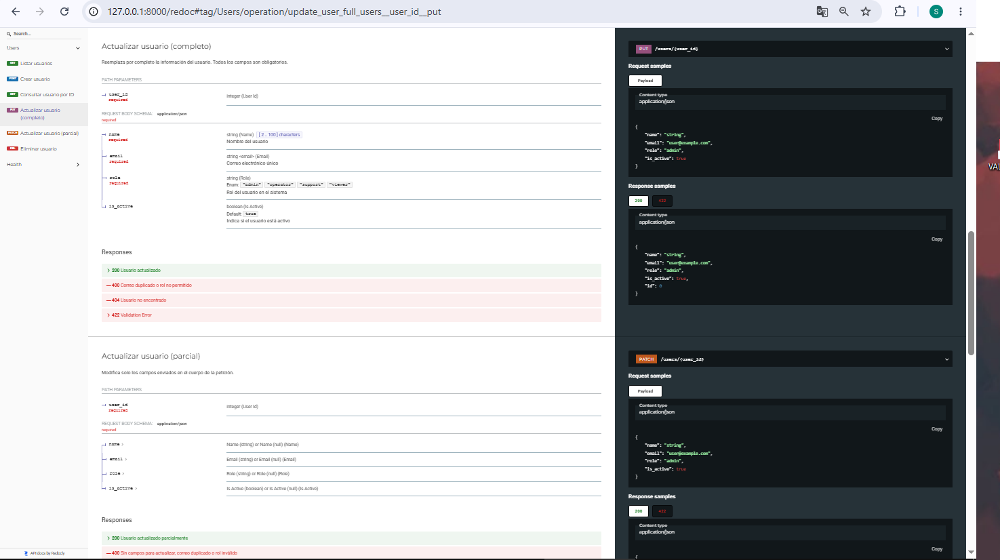

# device_systems

API REST desarrollada con **FastAPI** para la gestión de usuarios del sistema `device_systems`. Evolución de la actividad anterior (EV07) hacia un CRUD completo con manejo profesional de errores, códigos HTTP, documentación OpenAPI y **Dependency Injection**.

## Descripción

La API expone el recurso `/users` y permite crear, listar, consultar, filtrar, actualizar (completa y parcialmente) y eliminar usuarios. Los datos se almacenan en memoria para fines académicos.

## Tecnologías

- Python 3.10+
- FastAPI
- Uvicorn
- Pydantic v2
- email-validator

## Estructura del proyecto

```
device_systems/
├── app/
│   ├── main.py                 # Configuración FastAPI y metadatos OpenAPI
│   ├── routes/
│   │   └── user_routes.py      # Endpoints HTTP
│   ├── schemas/
│   │   └── user_schema.py      # Modelos Pydantic entrada/salida
│   ├── services/
│   │   └── user_service.py     # Lógica de negocio
│   ├── dependencies/
│   │   └── user_dependencies.py # Depends(): usuario 404, email, rol, API key
│   └── data/
│       └── users_db.py         # Base de datos en memoria
├── requirements.txt
└── README.md
```

| Capa | Responsabilidad |
|------|-----------------|
| `routes` | Definición de endpoints y códigos de respuesta |
| `schemas` | Validación y serialización con Pydantic |
| `services` | Reglas de negocio y orquestación |
| `dependencies` | Lógica reutilizable con `Depends()` |
| `data` | Persistencia simulada en memoria |

## Instalación

```bash
cd device_systems
python -m venv venv
venv\Scripts\activate
pip install -r requirements.txt
```

## Ejecutar el servidor

```bash
cd device_systems
uvicorn app.main:app --reload --host 127.0.0.1 --port 8000
```

- **Swagger UI:** http://127.0.0.1:8000/docs  
- **ReDoc:** http://127.0.0.1:8000/redoc  

## Tabla de endpoints

| Método | Ruta | Descripción | Código éxito |
|--------|------|-------------|--------------|
| GET | `/users` | Listar usuarios (filtros: `role`, `is_active`) | 200 |
| GET | `/users/{user_id}` | Consultar por ID | 200 |
| POST | `/users` | Crear usuario | 201 |
| PUT | `/users/{user_id}` | Actualización completa | 200 |
| PATCH | `/users/{user_id}` | Actualización parcial | 200 |
| DELETE | `/users/{user_id}` | Eliminar usuario | 204 |

### Códigos de estado usados

| Código | Uso |
|--------|-----|
| 200 | Consulta o actualización exitosa |
| 201 | Usuario creado |
| 204 | Usuario eliminado (sin cuerpo) |
| 400 | Correo duplicado, rol inválido, PATCH vacío |
| 401 | API Key inválida (cabecera opcional) |
| 404 | Usuario no encontrado |
| 422 | Validación Pydantic fallida |

## Ejemplos de peticiones

### Listar usuarios

```http
GET /users
```

```json
[
  {
    "name": "Ana García",
    "email": "ana.garcia@device.com",
    "role": "admin",
    "is_active": true,
    "id": 1
  }
]
```

### Filtrar por rol y estado (reto integrador)

```http
GET /users?role=support&is_active=false
```

### Crear usuario

```http
POST /users
Content-Type: application/json

{
  "name": "Pedro Soto",
  "email": "pedro.soto@device.com",
  "role": "viewer",
  "is_active": true
}
```

**Respuesta 201:**

```json
{
  "name": "Pedro Soto",
  "email": "pedro.soto@device.com",
  "role": "viewer",
  "is_active": true,
  "id": 4
}
```

### Actualización completa (PUT)

```http
PUT /users/4
Content-Type: application/json

{
  "name": "Pedro Soto Actualizado",
  "email": "pedro.soto@device.com",
  "role": "operator",
  "is_active": false
}
```

### Actualización parcial (PATCH)

```http
PATCH /users/4
Content-Type: application/json

{
  "role": "support"
}
```

### Eliminar usuario

```http
DELETE /users/4
```

**Respuesta:** `204 No Content` (sin cuerpo)

## Escenarios de error

| Escenario | Respuesta |
|-----------|-----------|
| Usuario inexistente | `404` — `{"detail": "Usuario no encontrado"}` |
| Correo duplicado en POST/PUT | `400` — `{"detail": "El correo electrónico ya está registrado"}` |
| Rol no permitido | `400` — `{"detail": "Rol no permitido. Roles válidos: ..."}` |
| PATCH sin campos | `400` — `{"detail": "Debe enviar al menos un campo para actualizar"}` |
| Datos inválidos (email mal formado) | `422` — detalle de validación Pydantic |

## Dependency Injection (`Depends()`)

En `app/dependencies/user_dependencies.py` se centralizan funciones reutilizables:

- **`get_user_or_404`**: resuelve el usuario por `user_id` o lanza 404 (usado en GET, PUT, PATCH, DELETE por ID).
- **`validate_email_unique`**: evita correos duplicados.
- **`validate_role`**: comprueba roles permitidos (`admin`, `operator`, `support`, `viewer`).
- **`get_api_config`**: configuración general de la API.
- **`verify_api_key`**: simulación de autenticación con cabecera `X-API-Key` (opcional).

Ejemplo en rutas:

```python
def get_user_by_id(user: UserDep):
    return UserResponse(**user)
```

`UserDep` es `Annotated[dict, Depends(get_user_or_404)]`, de modo que FastAPI inyecta el usuario antes de ejecutar el endpoint.

## Manejo de errores

Se utiliza **`HTTPException`** de FastAPI en servicios y dependencias. Las respuestas siguen el formato estándar:

```json
{
  "detail": "Usuario no encontrado"
}
```

La validación de esquemas (campos obligatorios, formato de email, longitud de nombre) la realiza **Pydantic** automáticamente con código **422**.

## Documentación Swagger / OpenAPI

En `app/main.py` se configuran `title`, `description`, `version` y `contact`. Cada endpoint en `user_routes.py` incluye `summary`, `description`, `response_description` y el tag **`Users`**.

### Capturas (evidencia)

#### Swagger UI (`/docs`)



Vista de la documentación interactiva: endpoints **Users** (GET, POST, PUT, PATCH, DELETE), esquemas Pydantic y metadatos de la API v2.0.0.

#### ReDoc (`/redoc`)



Vista alternativa de OpenAPI con detalle de operaciones PUT/PATCH, parámetros, cuerpos de petición y códigos de respuesta (200, 400, 404, 422).

> Puedes agregar más capturas en la carpeta `capturas/` (pruebas de endpoints, errores 404/400/422 desde **Try it out** en Swagger) y enlazarlas aquí con el mismo formato.

## Pruebas recomendadas

1. **GET** `/users` y `/users/1`
2. **POST** `/users` con usuario válido
3. **PUT** `/users/1` con todos los campos
4. **PATCH** `/users/2` con `{"role": "support"}`
5. **DELETE** `/users/3`
6. Errores: ID inexistente, email repetido, PATCH `{}`, body inválido

Cabecera opcional de autenticación simulada:

```http
X-API-Key: mi-clave-secreta-123
```

## Reflexión — evolución del proyecto

Respecto a la versión inicial (solo GET y POST en un solo archivo), esta entrega separa responsabilidades en capas, implementa **CRUD completo**, aplica códigos HTTP semánticos, documenta la API para pruebas en **Swagger/ReDoc** y reduce duplicación con **Depends()**. El resultado es una API más mantenible, predecible ante errores y alineada con buenas prácticas REST en FastAPI.

## Autor

Actividad **GA1-220501096-01-AA1-EV08** — FastAPI Intermedio (SENA ADSO).
